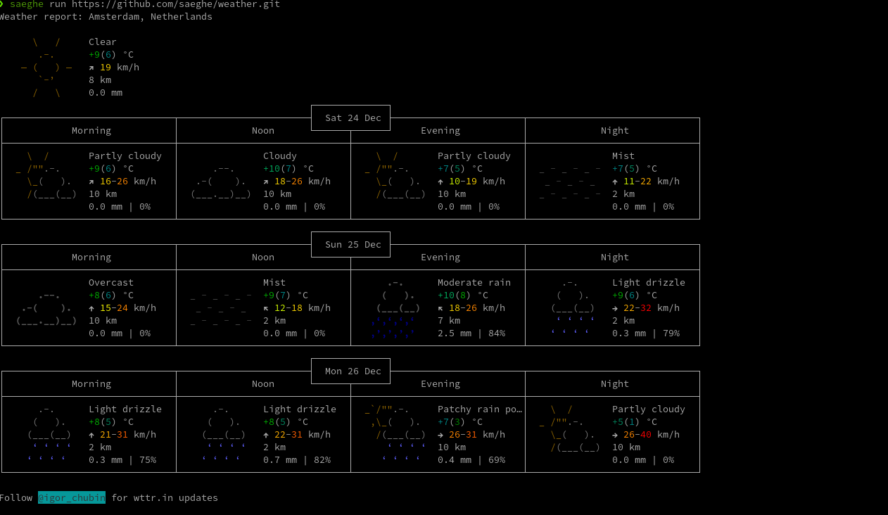

# Weather forecast package for Saeghe

## Introduction

This package is a Saeghe package for the weather forecasts. 

This is a sample package for using in the [Saeghe](https://saeghe.com)'s `run` command.

### Usages

You can run this package and see the result without installing it using Saeghe:

```shell
saeghe run https://github.com/saeghe/weather.git
```

Here is a sample output of running it using the `run` command:



If you need to install this package in your Saeghe application, then you can use Saeghe's `add` command:

```shell
saeghe add https://github.com/saeghe/weather.git
```
